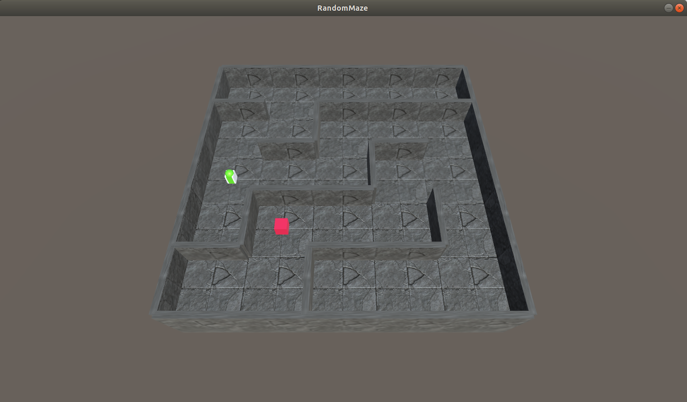
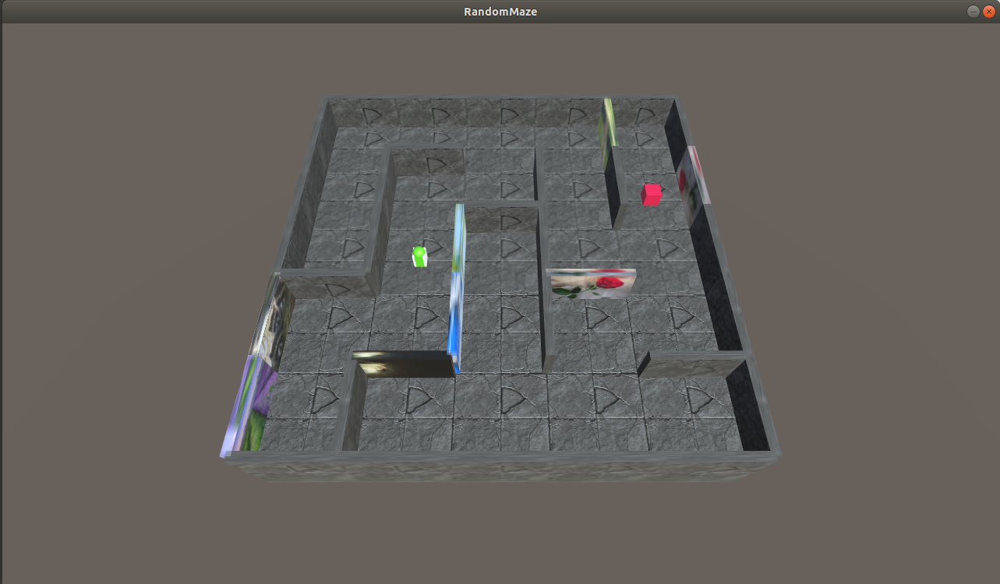
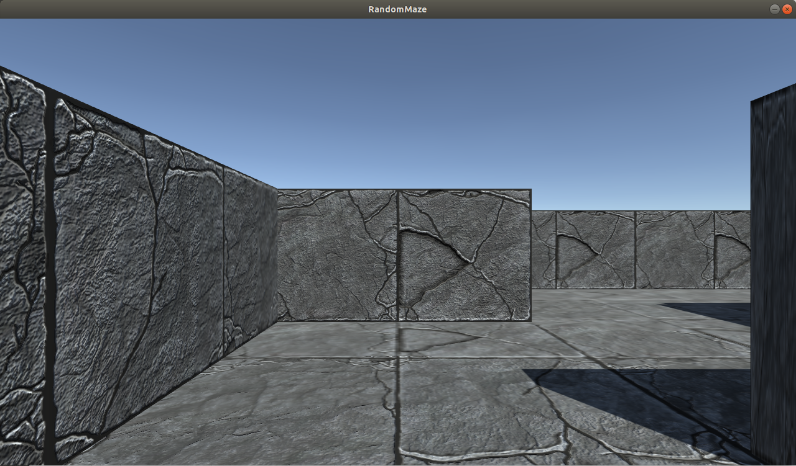
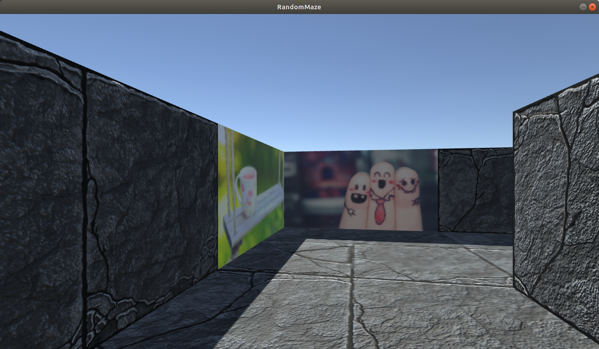
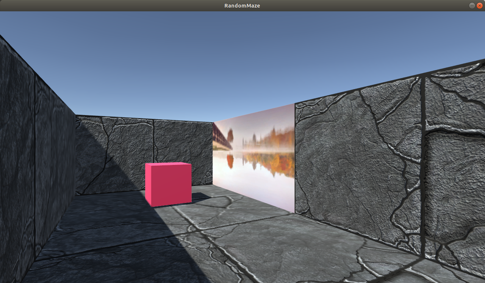

# RandomMazeEnvironment

When I read the paper [Large-Scale Study of Curiosity-Driven Learning](https://openreview.net/forum?id=rJNwDjAqYX) and want to test the agent in MazeEnvironment, I can't find this environment. So I make it by myself.  

This environment is a 5*5 maze, and it is randomly generated using DFS algorithm. When the agent reach the goal, it will get 1.0 reward. Then the maze will be re-generated, and the position of the agent and the goal will be reset. There are 2 version of the maze, with noisyTV (in 'RandonMaze' folder) and without noisyTV (in 'RandomMazeTV' folder).  

NoisyTV is just a wall with a picture on it. When agent active on an action, the picture will be randomly changed. There are 20 pictrues in all, it's a small TV.  

Note: I only build it for Ubuntu(Linux), there is no Windows or Mac version.  

## Requirement

ml-agent  
numpy  
Python 3.+  

I'm not sure Unity3D is necessary if just running and not editting it, maybe it is not.  

## Environment

The green object is the agent, and the red cube is the goal.  

  
  

## ObservationSpace

Only first person view is obtained, it's a image with a shape of (hight=720, width=1280, channel=3), like following examples.  

## ActionSpace

### Maze without noisyTV

A action is a four dimension numpy vector (action.shape = (4,)), represent 'moveForward', 'moveBackward', 'trunLeft' and 'turnRight'. I use 0.5 as threshold to decide whether or not performing the action. For example:  

(0.9, 0.2, 0.1, 0.3) means moveForward, the same as (1, 0, 0, 0)  
(0.3, 0.8, 0.9, 0.2) means moveBackward and turnLeft at the same time, the same as (0, 1, 1, 0)  

So, sigmoid function is a good choice to generate a action.  

### Maze with noisyTV

A action is a six dimension numpy vector (action.shape = (6,)), represent 'moveForward', 'moveBackward', 'trunLeft', 'turnRight', 'switchWSDirectionTV' and 'switchADDirectionTV'. 0.5 is used as threshold. For example:  

(0.2, 0.8, 0.1, 0.3, 0.7, 0.1) means moveForward and at the same time switch the TVs that are facing WS direction, the same as (0, 1, 0, 0, 1, 0)  

## Demo

### Maze without noisyTV

    python3 Demo.py

### Maze with noisyTV

    python3 DemoTV.py

## ForPlayer

For better understanding this environment, I build it in player-mode, so we can play it using keyboard. Just extract the zip file in the 'MazeForPlayer' folder and run it.

### Maze without noisyTV

W     -> moveForward  
S     -> moveBackward  
A     -> turnLeft  
D     -> turnRight  
Space -> change view (firstPersonView or skyView, an extra Key)  

### Maze with noisyTV

W     -> moveForward  
S     -> moveBackward  
A     -> turnLeft  
D     -> turnRight  
Space -> change view (firstPersonView or skyView, an extra Key)  
J     -> switchWSDirectionTV  
K     -> switchADDirectionTV  
